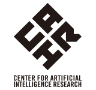
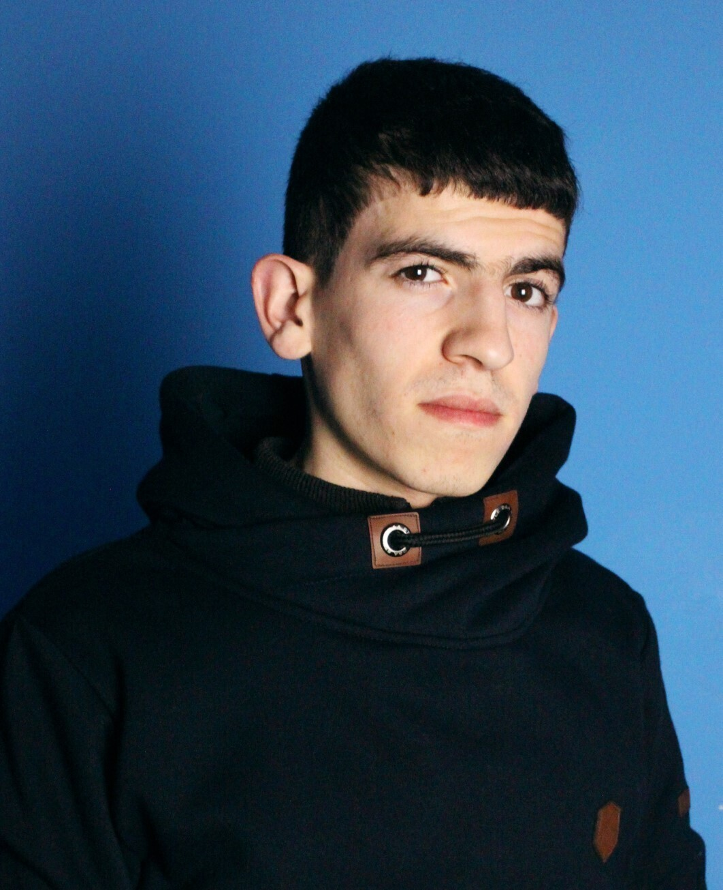

<div style="width: 30%; float: right;">

#### Sponsors

<a href = "https://www.tsukuba.ac.jp/en/">

```{r ut_sponsors, echo=FALSE, out.width = '52%', fig.align='left'}
knitr::include_graphics("imgs/ut2.png")
```

</a>

-----

<a href = "https://www.univ-grenoble-alpes.fr/english/">

```{r uga_sponsors, echo=FALSE, out.width = '42%', fig.align='left'}
knitr::include_graphics("imgs/uga2.png")
```
</a>

-----

<a href = "https://www.ruhr-uni-bochum.de/en">

```{r rub_sponsors, echo=FALSE, out.width = '42%', fig.align='left'}
knitr::include_graphics("imgs/rub.png")
```

</a>

-----

<a href = "https://www.cnrs.fr/en">

```{r cnrs, echo=FALSE, out.width = '42%', fig.align='left'}
knitr::include_graphics("imgs/cnrs.png")
```

</a>

-----

<a href = "https://www.univ-grenoble-alpes.fr/english/">

```{r region, echo=FALSE, out.width = '72%', fig.align='left'}
knitr::include_graphics("imgs/region.png")
```

</a>

-----

<a href = "https://air.tsukuba.ac.jp/en/">

```{r c_air, echo=FALSE, out.width = '50%', fig.align='left', }

```

</a>

-----

<a href = "https://www.grenoble-inp.fr/en">

```{r inp, echo=FALSE, out.width = '50%', fig.align='left'}
knitr::include_graphics("imgs/Grenoble_INP.png")
```

</a>


</div>


<div style="width: 63%; float: left;">

<br/>


## Co-chairs

-----

<div>

<div style="width: 33%; float: left">

#### Jeongwoo Kang
<!-- PhD Student -->
```{r Jeongwoo, echo=FALSE, out.width = '74%', fig.align='left'}

```

</div>

<div style="width: 33%; float: left">

#### Jonathan Evertz
<!-- PhD Student -->
```{r Jonathan, echo=FALSE, out.width = '67%', fig.align='left'}
knitr::include_graphics("imgs/Jonathan.jpg")
```

</div>

<div style="width: 33%; float: right">

#### Prince Gashongore
<!-- Post-Doc	Student -->
```{r Prince, echo=FALSE, out.width = '86%', fig.align='left'}
knitr::include_graphics("imgs/missing_avatar.svg")
```

</div>

<br/>

<br/>
<br/>

<br/>
<br/>
<br/>


-----

<br/>

<br/>
<br/>

<br/>


It is our great pleasure to warmly invite you to the 2022 International Collaborative Workshop of RUB-UGA-UT, 4th Edition - Recent Trends in Computer Science and Artificial Intelligence (CollaboTICS 2022) between the University of Grenoble-Alpes, Ruhr-Universität Bochum and the University of Tsukuba as part of their academic partnership. Here, we hope to promote the international exchange of expertise even further as topics of Artificial Intelligence are becoming of high concern recently. Our vision is that this event will create new research opportunities, encourage open and independent mindsets, and increase the scientific network among our working groups.

Prince, Jeongwoo & Jonathan


## General Organization

-----

<div style="width: 33%; float: left;"> 


#### Yuri Lavinas
PhD Candidate
```{r Lavinas, echo=FALSE, out.width = '79%', fig.align='left'}
knitr::include_graphics("imgs/myself3.png")
```
[Personal website](https://yurilavinas.github.io/)


</div>

<div style="width: 33%; float: left;">

#### Djafer Benchadi
PhD Student
```{r Djafer, echo=FALSE, out.width = '79%', fig.align='left'}

```


</div>


</div>
