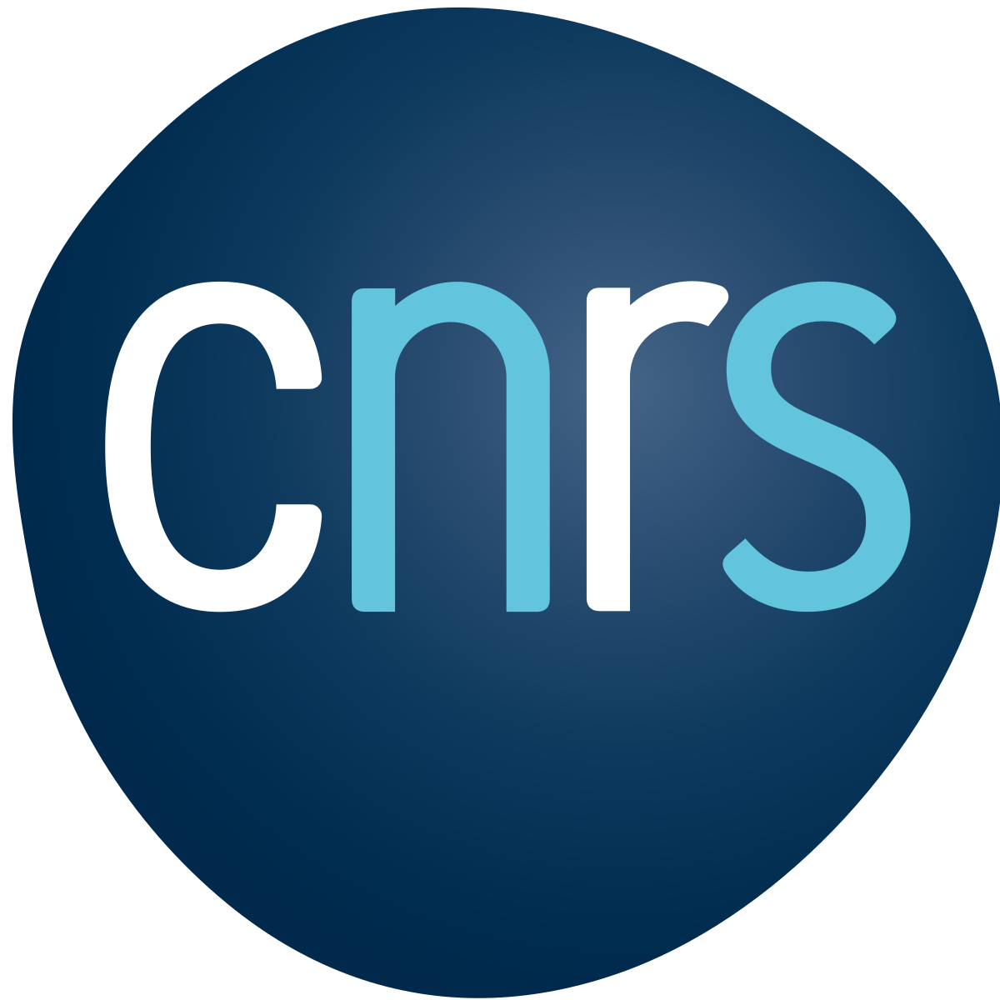

<div style="width: 30%; float: right;">

#### Sponsors

<a href = "https://www.tsukuba.ac.jp/en/">

```{r ut_sponsors, echo=FALSE, out.width = '52%', fig.align='left'}
knitr::include_graphics("imgs/ut2.png")
```

</a>

-----

<a href = "https://www.univ-grenoble-alpes.fr/english/">

```{r uga_sponsors, echo=FALSE, out.width = '42%', fig.align='left'}
knitr::include_graphics("imgs/uga2.png")
```
</a>

-----

<a href = "https://www.ruhr-uni-bochum.de/en">

```{r rub_sponsors, echo=FALSE, out.width = '42%', fig.align='left'}
knitr::include_graphics("imgs/rub.png")
```

</a>

-----

<a href = "https://www.cnrs.fr/en">

```{r cnrs, echo=FALSE, out.width = '42%', fig.align='left'}

```

</a>

-----

<a href = "https://www.univ-grenoble-alpes.fr/english/">

```{r region, echo=FALSE, out.width = '72%', fig.align='left'}
knitr::include_graphics("imgs/region.png")
```

</a>

-----

<a href = "https://air.tsukuba.ac.jp/en/">

```{r c_air, echo=FALSE, out.width = '50%', fig.align='left', }
knitr::include_graphics("imgs/c_air.png")
```

</a>

-----

<a href = "https://www.grenoble-inp.fr/en">

```{r inp, echo=FALSE, out.width = '50%', fig.align='left'}
knitr::include_graphics("imgs/Grenoble_INP.png")
```

</a>


</div>


 
<div style="width: 65%; float: left;">


The 2022 International Collaborative Workshop of RUB-UGA-UT, 4th Edition - Recent Trends in Computer Science and Artificial Intelligence (CollaboTICS 2022) is a collaborative workshop between the University of Grenoble-Alpes, Ruhr-Universität Bochum and the University of Tsukuba.

Our workshop will consist of sessions of oral presentations and poster presentations. Students, young researchers, and professors from both universities are welcome to present their current or past research in our workshop! We hope that through our workshop, students and professors from both universities can discuss their respective research topics and find opportunities for future collaborations.


### Worshop Implementation

The CollaboTICS 2022 is pleased to announce the full virtual conference program schedule.

### Important Information

#### Workshop dates

- Workshop Dates: 15 December 2022 - 16 December 2022
- Time: 
  - Japan time: 4 pm to 9pm.
  - France and German time: 8 am to 1 pm. 

- Deadline
-- General registration will be the 08 December 2022

#### Submission procedures


- Deadline
--- Poster/presentation material will be the DD December 2022.

<!-- We are sorry to announce that we are no longer accepting new presentations. -->

If you want to present at our workshop, please fill [this form](https://forms.gle/rcR6Ybo5n6sdC1yL9).

For more information see the [registration](https://CollaboTICS2022.github.io/registration) section.

#### Using Gather

TBA

<!-- [Click here](https://gather.town/invite?token=KQz_tOL_HoATchjTau33qxs7irtEM4N6) for an example room where prospective participants of the workshop can enter and explore the platform prior the event. -->


</div>
