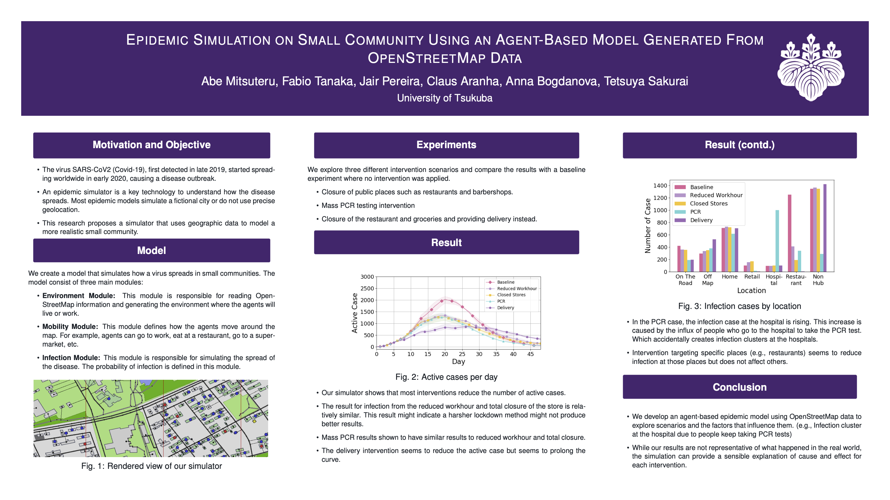
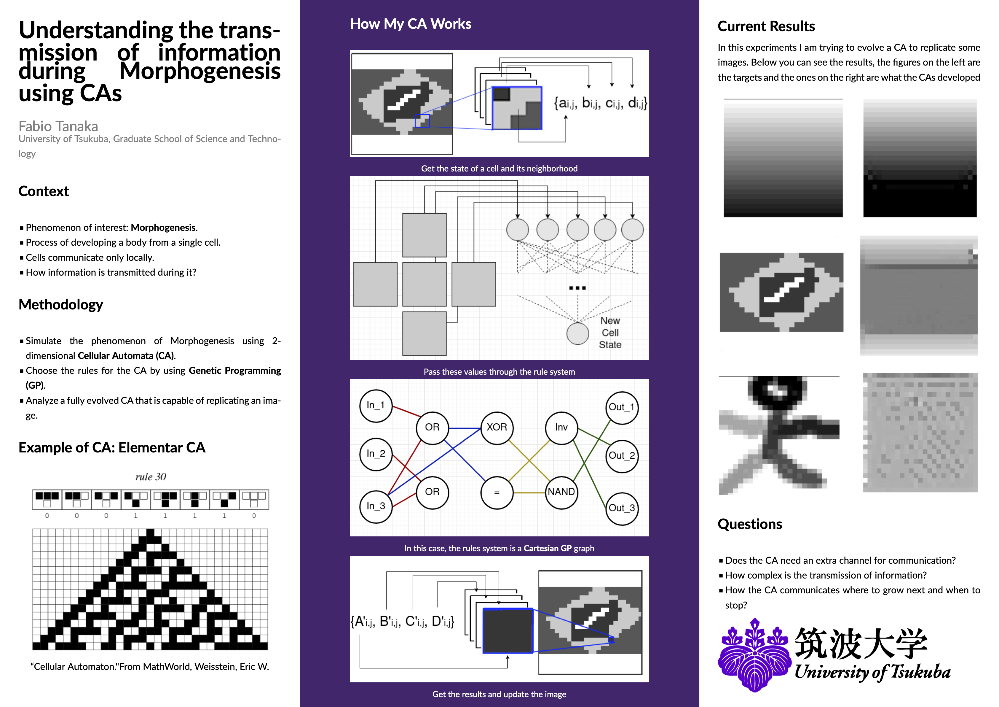
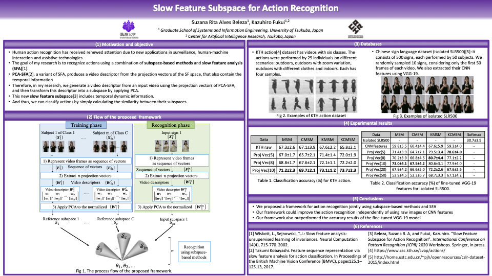
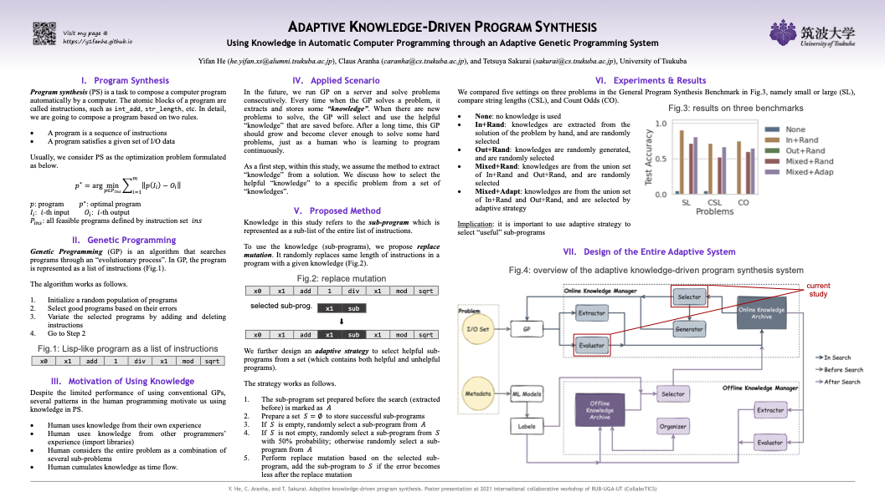
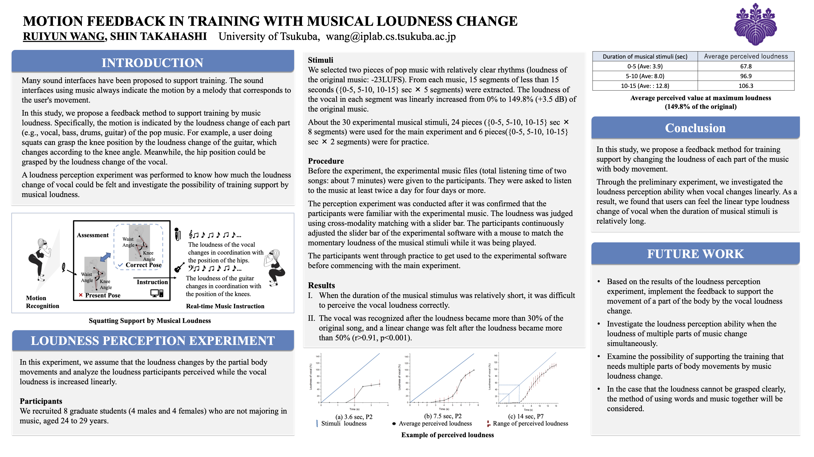
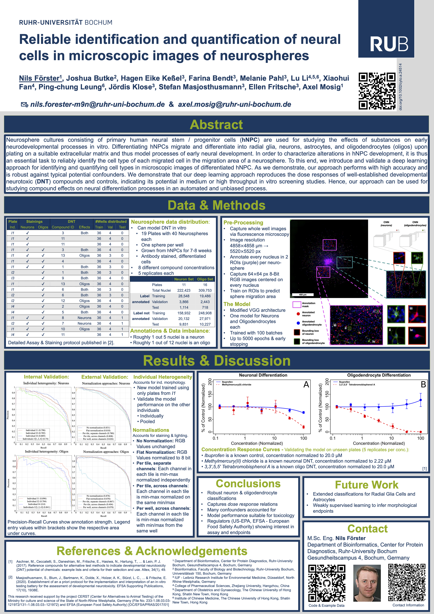

<div style="width: 30%; float: right;">

#### Sponsors

<a href = "https://www.tsukuba.ac.jp/en/">

```{r ut_sponsors, echo=FALSE, out.width = '52%', fig.align='left'}
knitr::include_graphics("imgs/ut2.png")
```

</a>

-----

<a href = "https://www.univ-grenoble-alpes.fr/english/">

```{r uga_sponsors, echo=FALSE, out.width = '42%', fig.align='left'}
knitr::include_graphics("imgs/uga2.png")
```
</a>

-----

<a href = "https://www.ruhr-uni-bochum.de/en">

```{r rub_sponsors, echo=FALSE, out.width = '42%', fig.align='left'}
knitr::include_graphics("imgs/rub.png")
```

</a>

-----

<a href = "https://www.cnrs.fr/en">

```{r cnrs, echo=FALSE, out.width = '42%', fig.align='left'}
knitr::include_graphics("imgs/cnrs.png")
```

</a>

-----

<a href = "https://www.univ-grenoble-alpes.fr/english/">

```{r region, echo=FALSE, out.width = '72%', fig.align='left'}
knitr::include_graphics("imgs/region.png")
```

</a>

-----

<a href = "https://air.tsukuba.ac.jp/en/">

```{r c_air, echo=FALSE, out.width = '50%', fig.align='left', }
knitr::include_graphics("imgs/c_air.png")
```

</a>

-----

<a href = "https://www.grenoble-inp.fr/en">

```{r inp, echo=FALSE, out.width = '50%', fig.align='left'}
knitr::include_graphics("imgs/Grenoble_INP.png")
```

</a>


</div>

TBA

<!-- <div style="width: 65%; float: left;"> -->

<!-- ### Want to have an idea about what the poster presentations will be about? You can check their spotlight videos here! -->

<!-- ----- -->


<!-- <div> -->

<!-- ### Abe Mitsu Teru -->
<!-- Epidemic Simulation on Small Community Using an Agent-Based Model Generated From OpenStreetMap Data -->

<!-- - Click on the image to watch the video: -->


<!-- [](Poster_Kits/Abe-Poster_video.mp4 "ABE") -->

<!-- </div> -->

<!-- <br> -->

<!-- ----- -->

<!-- </br> -->

<!-- <div> -->

<!-- ### Erica Kido Shimomoto -->
<!-- Subspace Representation for Natural Language Processing -->

<!-- - Click on the image to watch the video: -->

<!-- [](Poster_Kits/Erica_CollaboTICS2021_spotlightvideo.mp4  "Erica-Poster") -->

<!-- </div> -->

<!-- <br> -->

<!-- ----- -->

<!-- </br> -->


<!-- <div> -->

<!-- ### Fabio Tanaka -->
<!-- Understanding the transmission of information during Morphogenesis usings CAs -->


<!-- - Click on the image to watch the video: -->

<!-- [](Poster_Kits/FabioTanaka_spotlight_video.mp4 "Fabio-Poster") -->

<!-- </div> -->

<!-- <br> -->

<!-- ----- -->

<!-- </br> -->


<!-- <div> -->

<!-- ### Yuri Lavinas -->
<!-- Suprises in Evolutionary Computation -->

<!-- - Click on the image to watch the video: -->

<!-- [](Poster_Kits/YURILAVINAS_WS_poster_collabotics_new.mp4  "Yuri-Poster") -->

<!-- </div> -->

<!-- <br> -->

<!-- ----- -->

<!-- </br> -->


<!-- <div> -->


<!-- ### Suzana Rita Alves Beleza -->
<!-- Slow Feature Subspace for Action Recognition -->


<!-- - Click on the image to watch the video: -->

<!-- [](Poster_Kits/suzana_spotlight_slides.mp4  "Suzana-Poster") -->

<!-- </div> -->

<!-- <br> -->

<!-- ----- -->

<!-- </br> -->


<!-- <div> -->

<!-- ### Yifan He -->
<!-- Using Knowledge in Automatic Computer Programming through an Adaptive Genetic Programming System -->


<!-- - Click on the image to watch the video: -->

<!-- [](Poster_Kits/Yifanworkshop.mp4 "Yifan-Poster") -->

<!-- </div> -->

<!-- <br> -->

<!-- ----- -->

<!-- </br> -->


<!-- <div> -->
<!-- ### Ruiyun Wang -->
<!-- Motion feedback in training with musical loudness change -->


<!-- - Click on the image to watch the video: -->

<!-- [](Poster_Kits/wang_video_tsukuba.mp4  "Wang-Poster") -->
<!-- </div> -->

<!-- <br> -->

<!-- ----- -->

<!-- </br> -->


<!-- <div> -->

<!-- ### Nils Foerster -->
<!-- Realible identification and quantification of neural cells in microscopic images of neurospheres -->


<!-- - Click on the image to watch the video: -->

<!-- [](Poster_Kits/foerster_CollaboTICS2021_spotlight.mp4  "Nils-Poster") -->

<!-- </div> -->

<!-- </div> -->